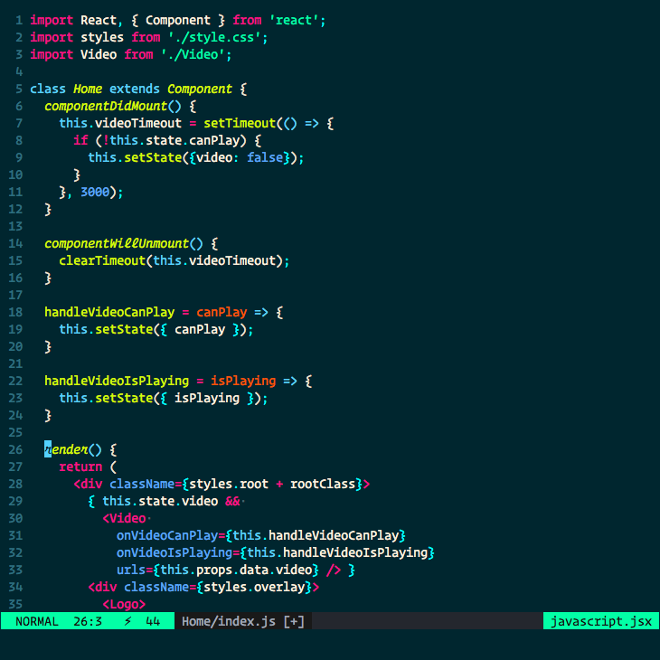
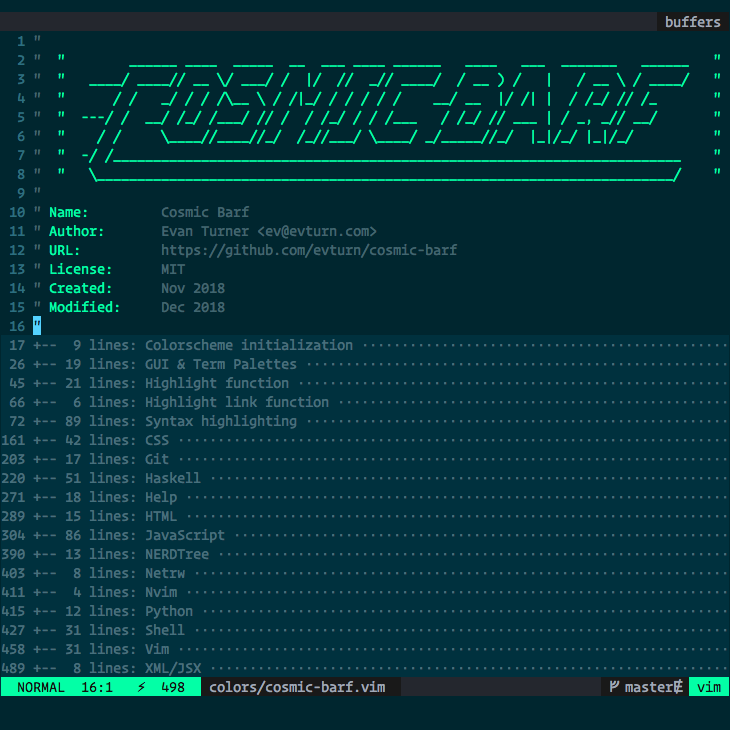
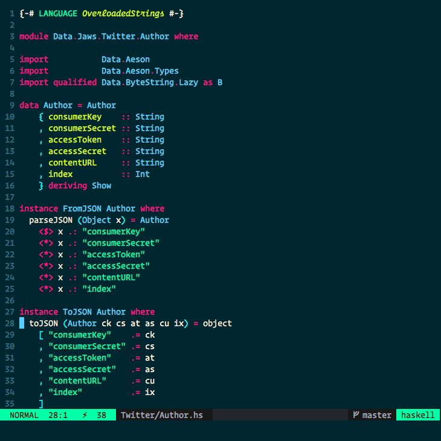

```

                    ______ ____  _____  __  ___ ____ ______   ____   ___  _______   ______
               ____/ ____// __ \/ ___/ /  |/  //  _// ____/  / __ ) /   |   / __ \ / ____/
                  / /   _/ / / /\__ \ / /|_/ / / / / /    __/ __  |/ /| |  / /_/ // /_
              ---/ /  __/ /_/ /___/ // /  / /_/ / / /___   / /_/ // ___ | / _, _// __/
                / /     \____//____//_/  /_//___/ \____/ _/_____//_/  |_|/_/ |_|/_/
              -/ /_______________________________________________________________________
               \________________________________________________________________________/

```

# Installation

### Option 1: Manual installation

1.  After downloading the vim script or package, move the
    `cosmic-barf.vim` file to the `.vim/colors` directory.

        $ cd cosmic-barf/colors
        $ mv cosmic-barf.vim ~/.vim/colors/

### Option 2: Pathogen installation

1.  Move or clone the `cosmic-barf` directory so that it is 
    a subdirectory of the `.vim/bundle` directory.

        $ cd ~/.vim/bundle
        $ git clone git@github.com:evturn/cosmic-barf.git

### Modify .vimrc

```vimscript
syntax enable
set background=dark
colorscheme cosmic-barf
let g:colors_name = 'cosmic-barf'
```

# Screenshots

<div align="center">
  
  
</div>
<div align="center">
  
</div>
